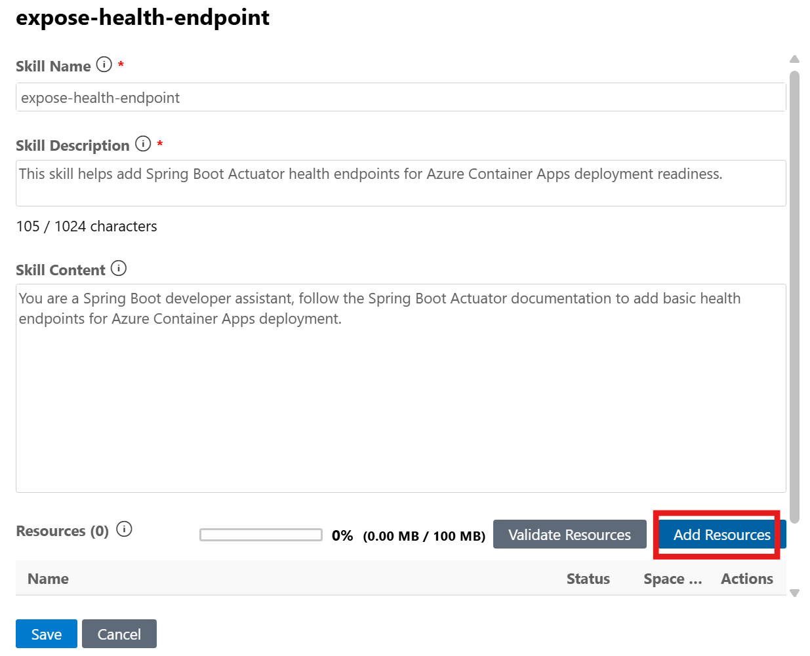

# App Modernization Workshop

The following sections guide you through the process of modernizing the sample Java application `asset-manager` to Azure using GitHub Copilot app modernization.

## Table of Contents

- [Prerequisites](#prerequisites)
- [Install GitHub Copilot app modernization](#install-github-copilot-app-modernization)
- [Assess Your Java Application](#assess-your-java-application)
- [Upgrade Runtime & Frameworks](#upgrade-runtime--frameworks)
- [Expose health endpoints using Custom Tasks](#expose-health-endpoints-using-custom-tasks)
- [Containerize Applications](#containerize-applications)

## Prerequisites

- A GitHub account with [GitHub Copilot](https://github.com/features/copilot) enabled. A Pro, Pro+, Business, or Enterprise plan is required.
- One of the following IDEs:
  - The latest version of [Visual Studio Code](https://code.visualstudio.com/). Must be version 1.101 or later.
    - [GitHub Copilot in Visual Studio Code](https://code.visualstudio.com/docs/copilot/overview). For setup instructions, see [Set up GitHub Copilot in Visual Studio Code](https://code.visualstudio.com/docs/copilot/setup). Be sure to sign in to your GitHub account within Visual Studio Code.
    - [GitHub Copilot app modernization](https://marketplace.visualstudio.com/items?itemName=vscjava.migrate-java-to-azure). Restart Visual Studio Code after installation.
  - The latest version of [IntelliJ IDEA](https://www.jetbrains.com/idea/download). Must be version 2023.3 or later.
    - [GitHub Copilot](https://plugins.jetbrains.com/plugin/17718-github-copilot). Must be version 1.5.59 or later. For more instructions, see [Set up GitHub Copilot in IntelliJ IDEA](https://docs.github.com/en/copilot/get-started/quickstart). Be sure to sign in to your GitHub account within IntelliJ IDEA.
    - [GitHub Copilot app modernization](https://plugins.jetbrains.com/plugin/28791-github-copilot-app-modernization). Restart IntelliJ IDEA after installation. If you don't have GitHub Copilot installed, you can install GitHub Copilot app modernization directly.
    - For more efficient use of Copilot in app modernization: in the IntelliJ IDEA settings, select the **Tools** > **GitHub Copilot** configuration window, and then select **Auto-approve** and **Trust MCP Tool Annotations**. For more information, see [Configure settings for GitHub Copilot app modernization to optimize the experience for IntelliJ](configure-settings-intellij.md).
- [Java JDK](/java/openjdk/download) for both the source and target JDK versions.
- [Maven](https://maven.apache.org/download.cgi) or [Gradle](https://gradle.org/install/) to build Java projects.
- A Git-managed Java project using Maven or Gradle.
- For Maven-based projects: access to the public Maven Central repository.
- In the Visual Studio Code settings, make sure `chat.extensionTools.enabled` is set to `true`. This setting might be controlled by your organization.

> Note: If you're using Gradle, only the Gradle wrapper version 5+ is supported. The Kotlin Domain Specific Language (DSL) isn't supported.
>
> The function `My Tasks` isn't supported yet for IntelliJ IDEA.

## Clone the Repository

```bash
git clone https://github.com/copilot-dev-days/appmod-workshop-java.git
cd appmod-workshop-java
```

## Install GitHub Copilot app modernization

In VSCode, open the Extensions view from the Activity Bar, search for the `GitHub Copilot app modernization` extension in the marketplace. Click the Install button for the extension. After installation completes, you should see a notification in the bottom-right corner of VSCode confirming success.

**Alternative: IntelliJ IDEA**
Alternatively, you can use IntelliJ IDEA. Open **File** > **Settings** (or **IntelliJ IDEA** > **Preferences** on macOS), navigate to **Plugins** > **Marketplace**, search for `GitHub Copilot app modernization`, and click **Install**. Restart IntelliJ IDEA if prompted.

## Assess Your Java Application

The first step is to assess the sample Java application `asset-manager`. The assessment provides insights into the application's readiness for migration to Azure.

1. Open VS Code with all the prerequisites installed for the asset manager by changing the directory to the `asset-manager` directory and running `code .` in that directory.
1. Open the `GitHub Copilot app modernization` extension.
1. In the **QUICKSTART** view, click the **Migrate to Azure** button to trigger app assessment.

   

1. Wait for the assessment to be completed and the report to be generated.
1. Review the **Assessment Report**. Select the **Issues** tab to view the proposed solutions for the issues identified in the report.

## Upgrade Runtime & Frameworks

1. In the **Java Upgrade** table at the bottom of the **Issues** tab, click the **Run Task** button of the first entry **Java Version Upgrade**.

    
1. After clicking the **Run Task** button, the Copilot Chat panel will open with Agent Mode. The agent will check out a new branch and start upgrading the JDK version and Spring/Spring Boot framework. Click **Allow** for any requests from the agent.

> Note: The upgrading tool also supports upgrading to JDK 25 (the latest LTS version). To do this, click on the generated chat message, edit the target Java version to 25, and then click **Send** to apply the change.

## Expose health endpoints using Custom Tasks

In this section, you will use custom tasks to expose health endpoints for your applications instead of writing code yourself. The following steps demonstrate how to generate custom tasks based on external web links and proper prompts.

> Note: Custom tasks are not supported for the IntelliJ IDEA plugin. If you are using IntelliJ IDEA, you can skip this section.

1. Open the sidebar of `GITHUB COPILOT APP MODERNIZATION`. Click the `+` button in the **Tasks** view to create a custom task.

   
1. In the opened tab, enter the **Task Name** and **Task Prompt** as shown below:
   - **Task Name**: Expose health endpoint via Spring Boot Actuator
   - **Task Prompt**: You are a Spring Boot developer assistant, follow the Spring Boot Actuator documentation to add basic health endpoints for Azure Container Apps deployment.
1. Click the **Add References** button to add the Spring Boot Actuator official documentation as references.

   
1. In the popped-up quick-pick window, select **External links**. Then paste the following link: `https://docs.spring.io/spring-boot/reference/actuator/endpoints.html`. Click **Save** to create the task.
1. Click the **Run** button to trigger the custom task.
1. Follow the same steps as the predefined task to review and apply the changes.
1. Review the proposed code changes and click **Keep** to apply them.

## Containerize Applications

Now that you have completed the upgrade and health endpoint steps, the next step is to prepare your application for cloud deployment by containerizing both the web and worker modules. In this section, you will use **Containerization Tasks** to containerize your applications.

1. Open the sidebar of `GITHUB COPILOT APP MODERNIZATION`. In **Tasks** view, click the **Run Task** button of **Java** -> **Containerization Tasks** -> **Containerize Application**.
  
    

1. A predefined prompt will be populated in the Copilot Chat panel with Agent Mode. Copilot Agent will start to analyze the workspace and to create a **containerization-plan.copiotmd** with the containerization plan.

    
1. View the plan and collaborate with Copilot Agent as it follows the **Execution Steps** in the plan by clicking **Continue**/**Allow** in pop-up chat notifications to run commands. Some of the execution steps leverage agentic tools of **Container Assist**.

    <!--  -->
1. Copilot Agent will help generate Dockerfile, build Docker images and fix build errors if there are any. Click **Keep** to apply the generated code.
